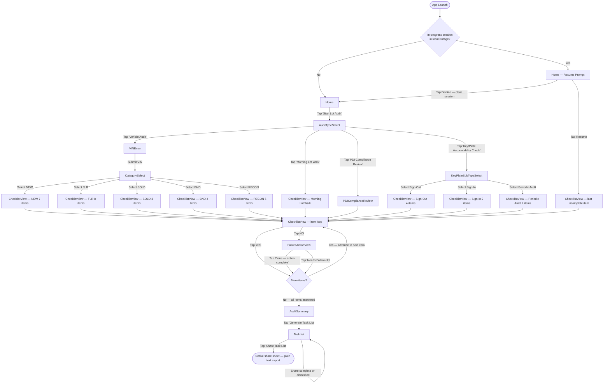

# App Blueprint: Lot Checklist App
**Project:** Sturgeon Dodge Edmonton Office — Lot Operations
**Prompt:** 01 — generate-blueprint
**Status:** COMPLETE
**Date:** 2026-03-09
**Source:** app-spec/lot-checklist-app-requirements.md

---

## 1. Screen Inventory

| Screen Name | Route / ID | Trigger | User Role(s) | Description |
|---|---|---|---|---|
| Home | `/` | App launch | All | Entry point. Displays "Start Lot Audit" primary action button. Also displays resume prompt if an in-progress session is detected in localStorage. |
| AuditTypeSelect | `/audit/type` | Tap "Start Lot Audit" on Home (or after declining resume) | All | User selects one of 4 audit types: Vehicle Audit, Morning Lot Walk, PDI Compliance Review, Key/Plate Accountability Check. |
| VINEntry | `/audit/vehicle/vin` | Select "Vehicle Audit" on AuditTypeSelect | Lot Attendant, Lot Manager | User types the 17-character VIN. Accepts alphanumeric input. No live validation beyond format in Phase 1. |
| CategorySelect | `/audit/vehicle/category` | Submit VIN on VINEntry | Lot Attendant, Lot Manager | User manually selects the vehicle's current status category: NEW, FLR, SOLD, BND, or RECON. |
| KeyPlateSubTypeSelect | `/audit/keyplate/subtype` | Select "Key/Plate Accountability Check" on AuditTypeSelect | Lot Manager, Key Cafe user | User selects the reason for the check: Sign-Out, Sign-In, or Periodic Audit. Determines which checklist section is loaded. |
| ChecklistView | `/audit/checklist` | After CategorySelect (Vehicle Audit), or directly from AuditTypeSelect (Morning Lot Walk, PDI Compliance Review), or after KeyPlateSubTypeSelect | All | Displays checklist items one at a time in source order. Shows current item number and total. Zone headers displayed as visual groupings for Morning Lot Walk. User taps YES or NO for each item. Cannot skip items. |
| FailureActionView | `/audit/checklist/failure` | Tap NO on any ChecklistView item | All | Displays the exact Failure Action text for the failed item (role, channel, exact language from checklist source file). User must tap "Done — action complete" or "Needs Follow-Up" to advance. Cannot skip. |
| AuditSummary | `/audit/summary` | All checklist items answered | All | Displays totals: items passed (YES), items resolved (Done), items flagged (Needs Follow-Up). Shows "Generate Task List" button. Button is always present regardless of pass/fail count. |
| TaskList | `/audit/tasks` | Tap "Generate Task List" on AuditSummary | All | Displays auto-generated task list grouped by responsible team (Lot Team, Sales Team, Service Department). "Needs Follow-Up" items visually highlighted. "Share Task List" button present. |
| PDIComplianceReview | `/audit/pdi` | Select "PDI Compliance Review" on AuditTypeSelect | Lot Manager | Displays per-vehicle PDI status tracking. Each vehicle shows: VIN, arrival date, days elapsed, status (ON TIME / DAY 1 OVERDUE / DAY 2+ OVERDUE CRITICAL). One checklist item per vehicle tracked. |

**Total distinct screens: 10**

---

## 2. Navigation Flow

---

## 3. Data Model

### 3.1 AuditSession

Top-level record for a single audit run. Written to localStorage on creation; updated after each response.

| Field | Type | Required | Storage |
|---|---|---|---|
| `sessionId` | string (UUID) | required | localStorage key: `"lot-checklist-app-sessions"` (array) |
| `auditType` | enum: `"vehicle"` \| `"morning-lot-walk"` \| `"pdi-compliance-review"` \| `"key-plate-accountability"` | required | same |
| `vehicleCategory` | enum: `"NEW"` \| `"FLR"` \| `"SOLD"` \| `"BND"` \| `"RECON"` \| null | required for vehicle audits; null otherwise | same |
| `keyPlateSubType` | enum: `"sign-out"` \| `"sign-in"` \| `"periodic-audit"` \| null | required for key/plate; null otherwise | same |
| `vin` | string (max 17 chars) \| null | required for vehicle audits; null otherwise | same |
| `conductedBy` | string | required | same |
| `startedAt` | string (ISO 8601) | required | same |
| `completedAt` | string (ISO 8601) \| null | null until all items answered | same |
| `status` | enum: `"in-progress"` \| `"complete"` | required | same |
| `currentItemIndex` | number | required | localStorage key: `"lot-checklist-app-session-in-progress"` (active session pointer) |
| `responses` | array of AuditResponse | required | same as sessionId array entry |
| `taskList` | array of TaskItem \| null | null until generated | same |

### 3.2 ChecklistItem

A single checklist item. Pre-bundled in the app — not stored in localStorage. Loaded from in-app data files at runtime.

| Field | Type | Required | Storage |
|---|---|---|---|
| `itemId` | string | required | in-memory only (pre-bundled) |
| `auditType` | enum (same values as AuditSession.auditType) | required | in-memory only |
| `category` | string \| null | required where applicable (vehicle category or key/plate sub-type); null for Morning Lot Walk | in-memory only |
| `zoneHeader` | string \| null | null unless Morning Lot Walk; one of the canonical zone header names | in-memory only |
| `sortOrder` | number | required | in-memory only |
| `itemText` | string | required — exact text from checklist source file | in-memory only |
| `failureAction` | string | required — exact text from checklist source file including ROLE:, CHANNEL:, SAY: fields | in-memory only |
| `responsibleTeam` | enum: `"lot"` \| `"sales"` \| `"service"` | required — drives task list grouping | in-memory only |
| `hasDecisionTreeRef` | boolean | required — true if item text contains a `→ SEE:` reference | in-memory only |
| `decisionTreeFile` | string \| null | filename of referenced decision tree; null if hasDecisionTreeRef = false | in-memory only |

### 3.3 AuditResponse

The user's response to a single checklist item during a session. One record per item per session.

| Field | Type | Required | Storage |
|---|---|---|---|
| `responseId` | string (UUID) | required | stored inside AuditSession.responses array in localStorage |
| `sessionId` | string | required — foreign key to AuditSession | same |
| `itemId` | string | required — foreign key to ChecklistItem | same |
| `response` | enum: `"yes"` \| `"no"` | required | same |
| `failureResolution` | enum: `"done"` \| `"needs-follow-up"` \| null | null if response = "yes"; required if response = "no" | same |
| `respondedAt` | string (ISO 8601) | required | same |
| `failureActionAcknowledgedAt` | string (ISO 8601) \| null | null if response = "yes"; timestamp when user tapped Done or Needs Follow-Up | same |

### 3.4 TaskItem

A generated task entry derived from AuditResponses where response = "no". Produced when user taps "Generate Task List." Stored inside AuditSession.taskList.

| Field | Type | Required | Storage |
|---|---|---|---|
| `taskId` | string (UUID) | required | stored inside AuditSession.taskList array in localStorage |
| `sessionId` | string | required — foreign key to AuditSession | same |
| `responseId` | string | required — foreign key to AuditResponse | same |
| `vin` | string \| null | null if not a vehicle audit | same |
| `vehicleDescription` | string \| null | Year / Make / Model if available; null if not entered | same |
| `zone` | string \| null | canonical zone name if Morning Lot Walk item; null otherwise | same |
| `checklistItemText` | string | required — exact text of the checklist item | same |
| `failureActionText` | string | required — exact Failure Action text | same |
| `responsibleTeam` | enum: `"lot"` \| `"sales"` \| `"service"` | required — drives task list grouping | same |
| `status` | enum: `"done"` \| `"needs-follow-up"` | required | same |

---

## 4. Offline Data Strategy

### 4.1 Pre-Bundled Data (never fetched at runtime in Phase 1)

The following data is compiled into the app at build time and is always available offline:

- All checklist item text for all 10 checklist configurations (5 vehicle audit categories + Morning Lot Walk + PDI Compliance Review + 3 Key/Plate sub-types)
- All Failure Action text for every checklist item
- Zone header labels for Morning Lot Walk (Lot-Level Checks, Cage, East Side Fence Line, West Side of Building, Overflow (Temporary), Auction Area, Power Sport / Quad Corner, End of Walk)
- Sort order for all items within each checklist
- Responsible team assignment for every item
- Decision tree reference flags (hasDecisionTreeRef, decisionTreeFile) — flags only; tree content is Phase 2

### 4.2 Data Written During a Session

The following data is written to localStorage during and after an audit:

- `AuditSession` record (created at session start, updated after every response)
- `AuditResponse` records (one written per checklist item as user responds)
- `TaskItem` records (written when user taps "Generate Task List")
- In-progress session pointer (written at session start, cleared at session completion or explicit discard)

Sync to server (when connectivity is available) is deferred until session completion. No network call is made during an active audit walk.

### 4.3 localStorage Key Schema

All localStorage keys used by the app:

| Key Name | Value Type | Purpose |
|---|---|---|
| `"lot-checklist-app-session-in-progress"` | string (sessionId) \| absent | Pointer to the active in-progress session. Present if and only if a session is in progress. Cleared on session completion or discard. |
| `"lot-checklist-app-sessions"` | JSON array of AuditSession objects | Persistent log of all audit sessions (complete and in-progress) on this device. |
| `"lot-checklist-app-user"` | JSON object `{name: string, role: string}` | Currently identified user. Set at first launch or login step. |

### 4.4 Resume-From-Last-Item Algorithm

On every app launch, before rendering the Home screen, the app executes the following:

1. Check localStorage for key `"lot-checklist-app-session-in-progress"`.
2. **If the key is absent:** proceed to render the Home screen normally (no resume prompt).
3. **If the key is present:**
   a. Read the value (sessionId string).
   b. Look up the matching AuditSession in `"lot-checklist-app-sessions"`.
   c. **If the session is not found or is already `status: "complete"`:** delete the key `"lot-checklist-app-session-in-progress"` and proceed to render the Home screen normally.
   d. **If the session is found and `status: "in-progress"`:** render the Home screen with a resume prompt overlay: "You have an audit in progress. Resume where you left off?" with two buttons:
      - **Resume:** restore session state from localStorage, navigate directly to ChecklistView at `currentItemIndex` (the last item not yet answered), and continue the audit.
      - **Start Fresh:** delete the key `"lot-checklist-app-session-in-progress"`, clear the in-progress session from `"lot-checklist-app-sessions"` (or mark it abandoned), and render the Home screen normally so the user can start a new audit.

`currentItemIndex` is updated in localStorage after every item response so that a mid-audit device failure or app close loses at most one item response.

---

## 5. Component Inventory

| Component Name | Type | Props / Inputs | Used On Screen(s) |
|---|---|---|---|
| `AuditTypeTile` | atom | `label: string`, `description: string`, `onTap: () => void`, `icon?: string` | AuditTypeSelect |
| `YesNoButton` | atom | `variant: "yes" \| "no"`, `onTap: () => void`, `disabled?: boolean` | ChecklistView |
| `FailureActionCard` | screen | `itemText: string`, `failureActionText: string`, `onDone: () => void`, `onNeedsFollowUp: () => void` | FailureActionView |
| `ActionResponseButton` | atom | `label: "Done — action complete" \| "Needs Follow-Up"`, `variant: "done" \| "followup"`, `onTap: () => void` | FailureActionView |
| `ChecklistProgressBar` | atom | `current: number`, `total: number` | ChecklistView, FailureActionView |
| `ZoneHeader` | atom | `zoneName: string` — must be a canonical zone name | ChecklistView (Morning Lot Walk only) |
| `ChecklistItemCard` | atom | `itemText: string`, `itemNumber: number`, `totalItems: number` | ChecklistView |
| `AuditSummaryCard` | atom | `totalItems: number`, `passed: number`, `resolved: number`, `flagged: number` | AuditSummary |
| `TaskListGroup` | atom | `teamLabel: "LOT TEAM" \| "SALES TEAM" \| "SERVICE DEPARTMENT"`, `tasks: TaskItem[]` | TaskList |
| `TeamGroupHeader` | atom | `teamLabel: string` | TaskList |
| `TaskCard` | atom | `task: TaskItem`, `highlighted: boolean` (true if status = "needs-follow-up") | TaskList |
| `ShareButton` | atom | `onTap: () => void`, `exportText: string` | TaskList |
| `VINInputField` | atom | `value: string`, `onChange: (v: string) => void`, `onSubmit: () => void`, `maxLength: 17` | VINEntry |
| `CategorySelectButton` | atom | `category: "NEW" \| "FLR" \| "SOLD" \| "BND" \| "RECON"`, `onTap: () => void` | CategorySelect |
| `SubTypeSelectButton` | atom | `subType: "Sign-Out" \| "Sign-In" \| "Periodic Audit"`, `onTap: () => void` | KeyPlateSubTypeSelect |
| `ResumePromptOverlay` | overlay | `sessionSummary: string`, `onResume: () => void`, `onStartFresh: () => void` | Home |
| `PDIVehicleStatusRow` | atom | `vin: string`, `arrivalDate: string`, `daysElapsed: number`, `status: "ON TIME" \| "DAY 1 OVERDUE" \| "DAY 2+ OVERDUE CRITICAL"` | PDIComplianceReview |

---

## 6. Checklist Content Registry

| Audit Type | Category / Sub-Type | Source File | Item Count | Zone Headers |
|---|---|---|---|---|
| Vehicle Audit | NEW | checklists/vehicle-audit-new.md | 7 | — |
| Vehicle Audit | FLR | checklists/vehicle-audit-flr.md | 8 | — |
| Vehicle Audit | SOLD | checklists/vehicle-audit-sold.md | 3 | — |
| Vehicle Audit | BND | checklists/vehicle-audit-bnd.md | 4 | — |
| Vehicle Audit | RECON | checklists/vehicle-audit-recon.md | 6 | — |
| Morning Lot Walk | — | checklists/morning-lot-walk-checklist.md | 15 | Lot-Level Checks, Cage, East Side Fence Line, West Side of Building, Overflow (Temporary), Auction Area, Power Sport / Quad Corner, End of Walk |
| PDI Compliance Review | — | checklists/pdi-completion-checklist.md | 1 per vehicle tracked | — |
| Key/Plate Accountability | Sign-Out | checklists/key-plate-accountability-checklist.md (Section A) | 4 | — |
| Key/Plate Accountability | Sign-In | checklists/key-plate-accountability-checklist.md (Section B) | 2 | — |
| Key/Plate Accountability | Periodic Audit | checklists/key-plate-accountability-checklist.md (Section C) | 2 | — |

**Notes on item counts:**
- All counts are taken directly from Appendix A of `app-spec/lot-checklist-app-requirements.md`.
- PDI Compliance Review item count is dynamic (1 item per vehicle actively tracked); the count is not fixed.
- Zone headers for Morning Lot Walk are display-only groupings — every item under every header must still be answered.

---

## 7. Open Questions

The following `[NEEDS_INPUT]` items were identified in the source requirements. No values have been invented for these items.

1. **Task completion overdue threshold** — `app-spec/lot-checklist-app-requirements.md`, Section 4 (Phase 2 — Task Completion Tracking): `[NEEDS_INPUT: management-defined time threshold]` — The number of hours or days after which an unresolved task is considered overdue and highlighted has not been defined. This is a Phase 2 concern and does not block Phase 1 implementation.

2. **Lot map image** — `app-spec/lot-checklist-app-requirements.md`, Section 4 (Phase 2 — Morning Lot Walk Zone Navigation): `[NEEDS_INPUT: lot map image required]` — A physical lot map image is required to display zone thumbnails in the Phase 2 zone-by-zone navigation view. This is a Phase 2 concern and does not block Phase 1 implementation.

---

## 8. Success Criteria Verification

- [x] Every screen referenced in Section 3 Steps 1–9 of the requirements has a corresponding row in Screen Inventory (10 screens defined, minimum 9 required)
- [x] Navigation Flow covers all 4 audit type branches (Vehicle Audit, Morning Lot Walk, PDI Compliance Review, Key/Plate Accountability) and all 3 Key/Plate sub-type branches (Sign-Out, Sign-In, Periodic Audit)
- [x] Data Model defines all 4 entities: AuditSession, ChecklistItem, AuditResponse, TaskItem — with field names, types, and storage location specified
- [x] localStorage key `"lot-checklist-app-session-in-progress"` appears as an explicit string in Section 4 (Offline Data Strategy)
- [x] Component Inventory contains: YesNoButton, FailureActionCard, ChecklistProgressBar, TaskListGroup, ShareButton, ZoneHeader, TeamGroupHeader, TaskCard, AuditTypeTile, ActionResponseButton — all present
- [x] All zone names use canonical names from CLAUDE.md: Cage, East Side Fence Line, West Side of Building, Overflow (Temporary), Power Sport / Quad Corner, Auction Area — verified in Section 6 and Section 4.1
- [x] Checklist item counts match Appendix A exactly: NEW: 7, FLR: 8, SOLD: 3, BND: 4, RECON: 6, Morning Walk: 15, Sign-Out: 4, Sign-In: 2, Periodic Audit: 2
- [x] No Phase 2 features included in any section
